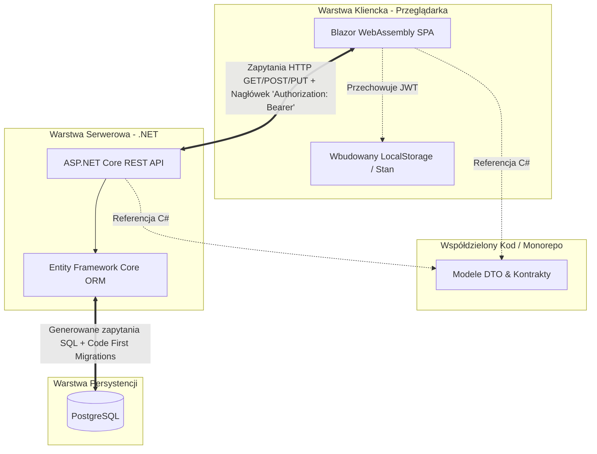
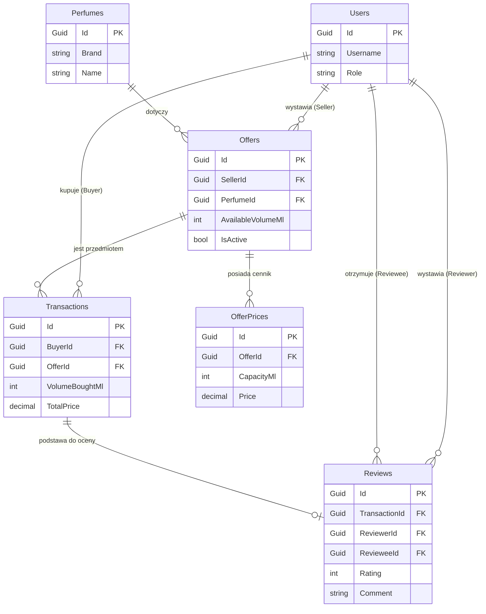

# studia-projektowanie-aplikacji-internetowych

TODO
- [x] plan dzialania
- [x] ADR (6 wpisow)
- [x] Opis projektu + diagram architektury
- [x] Baza
    - [x] kontener
    - [x] plan schematu
- [ ] Backend
    - [x] kontener
    - [x] migracje
    - [x] wpiecie ORMa
    - [x] data seed
    - [ ] role
    - [ ] endpointy
    - [ ]* memorycache
    - [x]* health
    - [ ]* walidacje danych
- [ ] Frontend
    - [ ] logowanie
    - [ ] widok glowny
    - [ ] widok konta
    - [ ] widok admina
- [x] docker compose 
- [ ] testy calosci   

# Opis projektu

Projekt to aplikacja webowa typu mini-commerce dla osób chcących kupować/sprzedawać odlewki perfum. 
Platforma w wersji alpha nie umozliwia platnosci, a jedynie pozwala kupujacym odnajdywac sprzedajacych oraz wystawiac sobie nawzajem opinie. 

Kluczowe funkcjonalności:
- Dodanie swoich perfum na sprzedaż przy określonych cenach
- Przeglądanie ofert innych uzytkowników
- Mozliwość złożenia zamówienia
- Mozliwość oceniania innych użytkowników po potwierdzeniu zawarcia transakcji z obydwu stron

# Stos technologiczny:
- frontend: Blazor WebAssembly
- backend: .NET 
- baza danych: Postgres (+ EF)

# Diagram architektury

# Schemat bazy danych

# Jak uruchomić

# ADR - Architecute Decision Record

## ADR 01 - Baza danych - relacyjna vs. nierelacyjna

### 1. Decyzja
Dla tego typu aplikacji dobrze sprawdzi sie baza relacyjna.

### 2. Kontekst
Aplikacja wymaga bazy danych do persystencji danych. Do rozważenia mamy bazy relacyjne vs. nierelacyjne. Aplikacja to mini-ecommerce z dobrze zdefiniwoanami encjami i wlasnosciami kazdej z nich.

### 3. Alternatywy

 - Nierelacyjna baza danych (np. mongodb)

### 4. Uzasadnienie
W obrebie aplikacji funkcjonuja jedynie dobrze zdefiniowane encje o konkretnych wartosciach - z gory wiemy jakie wlasnosci bedzie mial user, jakie perfum. Relacje miedzy tymi encjami nie beda ulegaly zmianom i sa latwe do przewidzenia. Dodatkowo, skoro aplikacja ma byc ecommercem, to musimy zapewnic transakcyjnosc, a to jest cos z czym bazy nosql nie radza sobie najlepiej. Zasadniczo zadne z zalet baz nosql nie beda tu mialy wiekszego zastosowania (ewolucja schematu, skalowalnosc, obiektowosc)

### 5. Tradeoffy
- utrudniona ewolucja schematu, wymusza migracje
- gorsze skalowanie 
- wymusza uzycie ORMa zamiast odczytywania gotowych obiektow

## ADR 02 - Baza danych - technologia

### 1. Decyzja
**PostgreSQL**

### 2. Kontekst
Po zadecydowaniu ze uzyta zostanie relacyjna baza danych, balezy zdecydowac sie na konkretna baze.

### 3. Alternatywy
- SQLite - nie nadaje sie do zastosowan gdzie uzytkownikow jest wielu i zapisy nie sa rzadkoscia, ze wzgledu na lockowanie calosci bazy przy zapisie
- Microsoft SQL Server - rozwiazanie closed source, bardzo drogie licencje

### 4. Uzasadnienie
Postgres jest darmowy, w pelni open-source i jest de facto standardem. Poradzi sobie z dowolna skala ktora jest przewidziana dla tego typu aplikacji. Ma integracje z Entity Frameworkiem. Jest latwo dostepny do hostowania u providerow chmury.

### 5. Tradeoffy
- trzeba stawiac osobny serwer (kontener) zamiast pojedynczego pliku jak w sqlite
- potencjalny overkill, wieksze zuzycie zasobow niz sqlite

## ADR 03 - Frontend

### <ins>1. Decyzja</ins>
**Blazor WebAssembly**

### 2. Kontekst
Aplikacja wymaga interaktywnego interfejsu uzytkownika, ktory bedzie komunikowal sie z backendem poprzez API Restowe lub grpc. Potrzebuje wybrac technologie ktora maksymalnie ulatwi komunikacje z backendem i zmaksymalizuje produktywnosc zespolu programistycznego (czytaj: moja).

### 3. Alternatywy
- React - chyba najbardziej oczywisty wybor, jednak moja niechec do JavaScriptu sprawia ze jesli jest alternatywa, to wole sie jej trzymac. Z nieco mniej osobistych powodow: wybor dowolnego frameworka JSowego wymuszalby context switching przy pracy nad frontem vs. backendem oraz generowania kontratkow do typowania
- Angular - to samo co wyzej, ale prog wejscia jest znancznie wyzszy
- Vue - znacznie prostszy, ale dalej jest to javascript

### 4. Uzasadnienie
Wybor Blazora na frontend pozwoli niewielkiemu zespolowi programistycznemu poruszac sie w obrebie jednego jezyka, co zdecydowanie pozytywnie wplynie na produktywnosc. Pozwoli to na utworzenie projektu zarowno dla frontu jak i backendu z DTOsami, co rozwiaze problem typowania i walidacji obiektow. Projekt aplikacji nie zaklada wspoldzielenia jej fragmentow w innych miejscach, wiec nie ma potrzeby tworzenia reuzywalnych komponentow. Nie przewiduje sie potrzeby integracji z bibliotekami JSowymi (co jest poprzez Blazora mozliwe, ale dosc karkolomne)

### 5. Tradeoffy
- blazor w trybie webassembly wymaga pobrania dosc duzego pliku startowego, co potencjalnie sprawi ze pierwsze zaladowanie strony bedzie wolniejsze niz gdyby uzyc frameworka JSowego
- blazor nie ma tak mocnej spolecznosci jak React/Angular/Vue, wiec ilosc gotowych komponentow i rozwiazan za pewne bedzie nieco mniejsza
- gdyby sie okazalo ze konieczna jest integracja z bibliotekami javascriptowymi, to moze sie ona okazac bardzo bolesna

## ADR 04 - Autentykacja

### <ins>1. Decyzja</ins>
**JWT**

### 2. Kontekst
Aplikacja musi umozliwiac zalozenie konta, a wiec potrzebujemy mechanizmu autentykacji ktory umozliwi bezpieczny dostep uzytkownikow do ich kont.

### 3. Alternatywy
- Session - mechanizm wymaga trzymania stanu po stronie serwera
- OAuth - znacznie bardziej skomplikowany w konfiguracji, wymaga integracji z zewnetrzynmi providerami

### 4. Uzasadnienie
Wybor JWT wynika z prostoty implementacji, bezstanowej obslugi oraz wbudowanej obslugi w .net, ktory jest uzyty jako backend aplikacji. Token jest latwy w obsludze zarowno od strony backendu (generujemy, podpisujemy) jak i frontu (dolaczamy do zapytania), szczegolnie w zestawieniu z mechanizmem sesji lub oauthem. Po stronie backendu calosc potrzebnych informacji do ochrony zasoobw mamy juz w tokenie, a po stronie klienta nie musimy przechodzic przez autentykacje z zewnetrznym dostawca.

### 5. Tradeoffy
- trudnosc w obsludze uniewaznienia tokenu w przypadku wylogowania usera
- niektorzy klienci mogliby oczekiwac OAutha tzn. mozliwosci zalogowania poprzez Facebooka/Google etc.

## ADR 05 - API Backendowe

### <ins>1. Decyzja</ins>
**Rest API**

### 2. Kontekst
Trzeba zadecydowac w jaki sposob aplikacja kliencka bedzie sie porozumiewala z serwerem. Do wyboru mamy API Restowe, gRPC albo graphQL. Aplikacja ma stosunkowo niewiele widokow, gdzie glowny, najwazniejszy widok (przegladarka perfum) bedzie wolany zdecydowanie najczesciej. 

### 3. Alternatywy
- gRPC - silnie typowany i (np. w polaczeniu z proto) szybszy niz REST, ulatwia prace przy mieszanych technologiach. Wymusza jednak tworzenie kontraktu i generacje klientow przez co jest skomplkowany w obsludze. Przy Blazor+.net oraz niewielkiej aplikacji ecommerce to zdecydowany overkill
- GraphQL - ciekawa alternatywa, pomaga rozwiazac problem overfetchingu, natomiast ma dosc wysoki prog wejscia, wymaga szerokiej integracji na backendzie. Skomplikowana (w porownaniu do RESTa) struktura zapytan zwieksza prawdopodobienstwo bledu.

### 4. Uzasadnienie
Standardowe API RESTowe jest najprostsze w implementacji i utrzymaniu. Nie ma potrzeby wprowadzania dodatkowej kontroli typow ze wzgledu na uzycie Blazora jako frontendu, co dyskwalifikuje uzycie gRPC. Aplikacja bedzie w znacznej mierze uzywala 2-3 endpointow RESTowych (do glownego widoku perfum oraz do widoku ofert konkretnej sztuki) co pozwoli na sprawne napisanie dedykowanych endpointow. W razie potrzeby, przy odpowiednio napisanych kilku endpointach, mozna bardzo latwo pokierowac agenta AI do napisania kolejnych analogicznych endpointow, co sprawia ze tworzenie dedykowanych endpointow bez zlozonej logiki dla konkretnych widokow jest bardzo wydajne, wiec uzycie GraphQLa do tego typu nieskomplikowanej aplikacji wydaje sie nieuzasadnione.

### 5. Tradeoffy
- nizsza wydajnosc endpointow niz w przypadku streamownia poprzez gRPC
- potrzeba dokladnego przemyslenia i zaprojektowania endpointow 

## ADR 06 - ORM 

### <ins>1. Decyzja</ins>
**Entity Framework**

### 2. Kontekst
Aplikacja musi korzystac z bazy danych, a do komunikacji backendu z baza potrzebny bedzie ORM lub chociaz microORM.

### 3. Alternatywy
- Dapper - microORM, wymaga wlasnorecznego pisania zapytan SQLowych, zajmuje sie jedynie mapowaniem z SQLa na obiekty C#. To dobry wybor dla projektow wymagajacych wysokiej kontroli nad zapytaniami, pozwala na dokladna kontrole nad wykonywana kwerenda. Jednak przez to nie robi sporo rzeczy ktore zapewnia nam EF.

### 4. Uzasadnienie
Entity Framework to standard branzowy, pozwalajacy na szybkie osiagniecie wysokiej produktywnosci, w zasadzie bez patrzenia na SQLa. Zapewnia integracje z kazda popularna technologia bazodanowa. Zapewnia mechanizm migracji typu "Code First" co pozwala na przeprowadzanie migracji poprzez definiowanie obiektow bezposrednio z poziomu C#. W przypadku tej aplikacji, ryzyko zwiazane z Entiy Frameworkiem (problemy z konfiguracja przy skomplikowanych zapytaniach) wydaja sie ograniczone do minimum, bo nie przewiduje skomplikowanej logiki biznesowej.

### 5. Tradeoffy
- EF tworzy warste abstrakcji, ktora co prawda zwieksza produtkywnosc, szczegolnie poczatkowo, to jednak wraz z rozwojem aplikacji potrafi zamienic sie w zrodlo problemow i magii
- stosunkowo latwo, w przypadku bardziej zlozonych zapytan, o natrafienie na problem N+1
